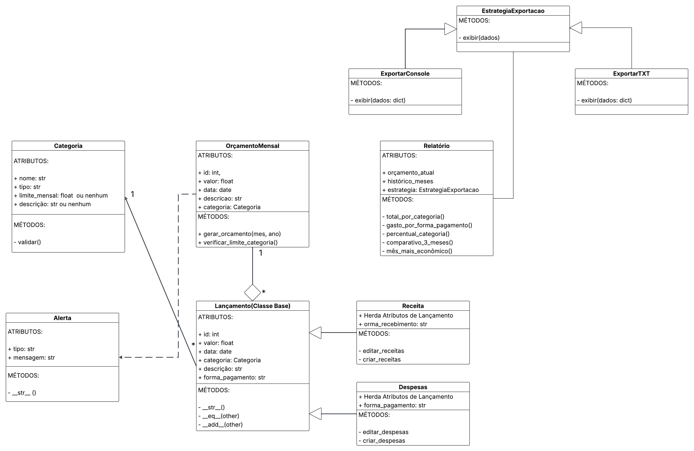

# 💰 Sistema de Controle de Despesas Pessoais

Sistema desenvolvido em Python para gerenciamento de receitas, despesas, categorias e orçamentos mensais, permitindo ao usuário acompanhar gastos, gerar relatórios e receber alertas automáticos sobre sua situação financeira.

Projeto baseado no **Tema 5 — Sistema de Controle de Despesas Pessoais**, da disciplina de **Programação Orientada a Objetos (UFCA)**.

---

## 🧱 Estrutura do Sistema

O sistema segue o paradigma da Programação Orientada a Objetos e foi modelado a partir do diagrama UML a seguir, contendo classes, heranças, composições, agregações e dependências:

### 📌 **Diagrama UML das Classes**



---

## 🧩 Descrição das Classes

### **1. SistemaFinanceiro**
Classe principal que coordena todas as operações do sistema.
- Gerencia categorias, lançamentos, orçamentos e alertas.
- Realiza integração com persistência e configurações globais.

---

### **2. Categoria**
Responsável por representar categorias de receita ou despesa.
- Cada categoria possui nome, tipo, limite e descrição.
- Utilizada por lançamentos e para cálculo de alertas.

---

### **3. Lancamento** (Classe Base)
Classe abstrata que representa um lançamento financeiro.
- Atributos: valor, data, categoria, forma de pagamento e descrição.
- Implementa validações e métodos especiais: `__str__`, `__repr__`, `__eq__`, `__lt__`, `__add__`.

---

### **4. Receita**
Especialização de `Lancamento`.
- Garantia de que o valor é positivo.
- Só pode utilizar categorias do tipo RECEITA.

---

### **5. Despesa**
Especialização de `Lancamento`.
- Verifica limites da categoria.
- Dispara alertas quando ultrapassa valores definidos.

---

### **6. OrcamentoMensal**
Controla todos os lançamentos de um mês específico.
- Calcula receitas, despesas e saldo disponível.
- Também gera alertas de déficit e limites ultrapassados.

---

### **7. Alerta**
Representa notificações automáticas do sistema.
- Pode indicar: alto valor, limite excedido, saldo negativo.
- Armazenado pelo `SistemaFinanceiro`.

---

### **8. Relatorio**
Classe dedicada à geração de relatórios estatísticos.
- Total de despesas por categoria.
- Gasto por forma de pagamento.
- Percentual por categoria.
- Comparativos entre meses.
- Mês mais econômico.

---

### **9. PersistenciaJSON**
Gerencia leitura e escrita de arquivos `.json` do sistema.
- Carrega e salva dados de forma centralizada.
- Utiliza o diretório `data/`.

---

### **10. SettingsLoader**
Gerencia configurações globais armazenadas em `settings.json`.
- Parâmetros como limites de alerta, metas e opções de relatórios.
- Permite leitura, atualização e persistência das configurações.

---

## ⚙️ Funcionalidades Principais

✔ Cadastro e gerenciamento de categorias de receita e despesa  
✔ Registro de receitas e despesas com validações rigorosas  
✔ Controle de orçamento mensal  
✔ Cálculo automático de saldos e limites  
✔ Geração de alertas automáticos:
- Despesa acima do limite da categoria  
- Despesa acima de valor mínimo configurado  
- Déficit orçamentário  

✔ Relatórios estatísticos:
- Total de despesas por categoria  
- Percentual por categoria  
- Comparativo dos últimos meses  
- Forma de pagamento mais utilizada  
- Mês mais econômico  

✔ Persistência completa em arquivos JSON  
✔ Configurações globais via `settings.json`  

---

## 💻 Tecnologias Utilizadas

- **Linguagem:** Python 3.12+  
- **Paradigma:** Programação Orientada a Objetos (POO)  
- **Bibliotecas padrão utilizadas:**
  - `json` → persistência de dados  
  - `datetime` → manipulação de datas  
  - `typing` → tipagem de listas e dicionários  
  - `os` → manipulação de diretórios e arquivos  

- **Formato de persistência:**  
  Arquivos `.json`:
  - `categorias.json`
  - `lancamentos.json`
  - `orcamentos.json`
  - `settings.json`

---

## 📋 Organização do Projeto

A estrutura de diretórios segue um padrão modular para facilitar manutenção, testes e escalabilidade.

```
sistema-controle-despesas/
│
├── src/
│   ├── main.py                     # Arquivo principal para execução do sistema
│   │
│   ├── classes/                    # Pacote contendo as classes do modelo financeiro
│   │   ├── alerta.py               # Classe de alertas automáticos
│   │   ├── categoria.py            # Classe de categorias de receita e despesa
│   │   ├── despesa.py              # Classe específica para despesas
│   │   ├── lancamento.py           # Classe base para lançamentos
│   │   ├── orcamento_mensal.py     # Classe para controle do orçamento mensal
│   │   ├── receita.py              # Classe específica para receitas
│   │   └── relatorio.py            # Geração de relatórios estatísticos
│   │
│   ├── sistema/                    # Núcleo do sistema e módulos auxiliares
│   │   ├── persistencia_json.py    # Persistência em arquivos JSON
│   │   ├── settings_loader.py      # Carregamento de configurações globais
│   │   └── sistema_financeiro.py   # Classe principal que coordena o sistema
│
├── data/                           # Armazena arquivos de dados persistentes
│   ├── categorias.json
│   ├── lancamentos.json
│   ├── orcamentos.json
│   └── settings.json
│
├── docs/                           # Documentação do projeto
│   └── UML_Sistema_Controle_Despesas.png
│
├── LICENSE                         # Licença do projeto
├── .gitignore                      # Arquivos ignorados no Git
│
└── README.md                       # Documentação geral do projeto
```